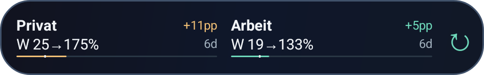

# Codex Quota Widget

An Android app and home-screen widget for viewing Codex quota, consumption forecasts and pacing for multiple ChatGPT accounts. Each account has its own bars, reset times, cached data and login. Percentages are never added across accounts.

[Download the latest APK](https://github.com/LoggeL/codex-quota-widget/releases/latest)



## Version 1.0.2

Consumption forecasts, the expected-consumption marker and ahead/deficit comparisons are restored for each account. Both accounts remain side by side in the default **4x1** layout.

- `W 25→175%`: 25% of the weekly quota used; at the same average pace, projected usage at reset is 175%.
- `+11pp`: 11 percentage points above the elapsed-time budget (deficit). `−11pp` means 11 points ahead. With two windows, the account header identifies the window with the greatest deficit, for example `W +11pp`.
- Bars show **consumed** quota; the white marker shows expected consumption at the last measurement. Amber starts at 7 points over budget, red at 15. The app explains every window separately, including remaining quota and reset times.
- `alt` or `!` marks an old snapshot or failed refresh. `?` means the forecast cannot be calculated. A reset invalidates the old forecast until new usage arrives.

The compact layout supports 250 x 56 dp, including both windows per account and 130% font scaling. Long values use compact notation (`1.4k%` means about 1,400%). Font sizes adapt when necessary to keep both the forecast and reset countdown complete. At 200 dp height or more (scaled with the system font size) the detailed layout returns; at 240 dp it also shows the written pace status per window.

**Updating from 1.0.0 or 1.0.1:** install 1.0.2 over the existing app. The application ID, signing certificate and encrypted account format are unchanged.

### How the forecast works

For a quota snapshot taken at time `t`, let `D` be the quota window duration and `R` its absolute reset time:

```text
elapsed = t - (R - D)
expected consumption = 100 * elapsed / D
budget delta = actual used percent - expected consumption
projected consumption at reset = actual used percent * D / elapsed
```

The duration reported by the API takes precedence; otherwise the fallback is five hours or seven days for the respective window. Calculations use the exact elapsed fraction before rounding display values. Projections can exceed 100% and are not capped at the quota limit. This is a linear estimate assuming the same average consumption rate, not a prediction of future activity or permission to exceed a limit.

Pacing is evaluated at the snapshot time, so cached usage does not appear to improve as the clock advances. The reset countdown still uses the current time. A missing reset, invalid window or completed reset yields no forecast. At the exact window start, the budget marker is zero but the projection is unknown because no time has elapsed. Account percentages and forecasts are never combined.

## Multi-account features

- Account cards with current consumption, remaining quota in the app, independent forecasts, budget comparisons and reset times.
- Add, rename and remove accounts. Signing in to the same account again renews its login instead of creating a duplicate.
- Weekly-only accounts display just their weekly window. Two accounts fit in the default 4x1 widget, including accounts with both windows. Enlarge it for more detailed status text.
- The widget displays the first two accounts and links to any additional accounts in the app.
- Per-account cache and errors: one expired login does not hide the other account.
- Device login continues while the browser is open and resumes after process recreation, until its 15-minute deadline. It can be cancelled.
- Android Keystore encryption for credentials, cached quota and pending login; cloud backup and device transfer are excluded.
- Android-managed background refresh, approximately every 30 minutes. Android can defer jobs to conserve battery. Tap ↻ for a refresh or the widget body to open the app.
- Reset countdowns use persisted absolute timestamps. Expired snapshots show the last known percentage and request an update; they never assume that quota has refilled.

### Installing over 0.4.0

The published 0.4.0 APK used a different signing certificate, whose private key is unavailable in this checkout. The 1.0.0 distribution uses the retained local signing key documented below. Android cannot install it over that 0.4.0 APK. Uninstall the old widget app, install 1.0.0, connect your accounts again and add the new widget. Uninstalling removes the old app's local login.

For installations signed with the same certificate, the app migrates the previous single-account login and cache into its encrypted store automatically. Migration writes the encrypted data before deleting the old plaintext preferences.

## Connect your accounts

1. Open Codex Quota and tap `Account hinzufügen`.
2. Copy the displayed code and open the login page with the provided button.
3. Select the intended ChatGPT account in the browser and approve its Codex device login. If needed, enable device-code login in the account's security settings.
4. Return to the app. Repeat for the second account, switching to that account in the browser first.
5. Rename the cards, for example `Privat` and `Arbeit`, and add the widget.

The Android app is independent of desktop account switchers. Signing in to the same accounts gives it their account-wide quotas without switching or restarting the desktop app. No desktop credentials, account IDs or personal data are included in the APK.

The app uses the ChatGPT-managed Codex device-code flow and the ChatGPT usage endpoint. This is an unofficial client; upstream authentication and response formats may change. There is no hosted quota proxy. Percentages describe each account's own limit, not a comparable number of tokens or money.

## Build and test

Requirements: JDK 17 or newer, Android SDK 35, Python 3 for packaging.

```sh
./gradlew testDebugUnitTest lintDebug assembleDebug
./gradlew assembleDebugAndroidTest
adb install -r app/build/outputs/apk/debug/app-debug.apk
adb install -r app/build/outputs/apk/androidTest/debug/app-debug-androidTest.apk
adb shell am instrument -w top.logge.codexquota.test/androidx.test.runner.AndroidJUnitRunner
```

To compile instrumentation against the signed release, supply the signing environment and run `./gradlew -PtestBuildType=release assembleReleaseAndroidTest`. Install that test APK alongside the release APK; Kotlin internal method names differ between build variants.

Run device tests only on a test device: they replace this app's account store with invented fixtures and clear it afterward. They exercise real Keystore encryption, single-account migration and Android rendering. Device screenshots use invented `Privat` and `Arbeit` accounts.

## Release packaging

Provide `ANDROID_HOME`, `JAVA_HOME`, `CODEX_WIDGET_KEYSTORE`, `CODEX_WIDGET_STORE_PASSWORD`, `CODEX_WIDGET_KEY_ALIAS` and `CODEX_WIDGET_KEY_PASSWORD` through the environment, then run:

```sh
python3 scripts/package_release.py
```

The script runs unit tests and release lint, builds a non-debuggable signed APK, checks its application ID and certificate, and writes the APK, SHA-256 checksums and build metadata under `artifacts/v<version>/`. Commit the tested source before packaging so `build-info.json` identifies a clean commit. Signing material stays outside Git.

The v1 signer SHA-256 fingerprint is `ff7f5e3369f7063ad452036834317fda47c1f40d329816f1d3e948004fb0c53c`. The script refuses other certificates unless `CODEX_WIDGET_EXPECTED_SIGNER` explicitly selects a different one. This certificate originated as the retained local Android development key; release builds disable debugging. Preserve the key for future compatible updates.

## Code structure

| Module | Responsibility |
| --- | --- |
| `CodexHttp`, `CodexAuth` | Stateless HTTP and OAuth. No blind retries of rotating refresh tokens. |
| `AccountStore`, `AccountCodec` | Atomic encrypted state, account identity, migration and account edits. |
| `LoginCoordinator` | One cancellable device login, persisted across process recreation. |
| `QuotaRepository` | Serialized refresh, token rotation, isolated caches and failures. |
| `UsageParser`, `QuotaCacheCodec` | Quota response normalization and timestamp preservation. |
| `QuotaPace`, `QuotaPresentation` | Snapshot-based forecasts, budget comparisons, remaining quota and freshness rules. |
| `QuotaUsageBar`, `CompactQuotaWidget` | Consumption/expected-marker rendering and the two-column 4x1 layout. |
| `QuotaRuntime`, `QuotaRefreshJob` | Application-scoped work, listeners and Android scheduling. |
| `MainActivity`, `CodexQuotaWidgetProvider` | Account management and native RemoteViews rendering. |

Tests cover weekly-only API shapes, missing data, cache age and reset expiry, separate account percentages, duplicate sign-ins, cancellation and process restoration, token rotation, account removal during refresh, and actual RemoteViews application/reapplication. Live browser approval requires the account owner and is not simulated by device fixtures.
